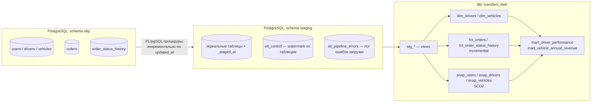

# Transfers DWH

Pet-проект: аналитическое хранилище данных (DWH) для сервиса трансферных
перевозок (Telegram Mini App). Делается как учебный проект с акцентом на инкрементальную загрузку,
историю изменений (SCD2) и оркестрацию пайплайна.

Само мини-приложение (фронт для менеджера/админа/водителя) в этот репозиторий
не входит - здесь только data-часть: OLTP-схема, ETL в staging, dbt-трансформации
и Airflow-оркестрация.

## Архитектура



Оркестрируется Airflow-DAG'ом `transfers_dwh_pipeline`
(`dags/transfer_pipeline.py`):

```
load_to_staging  →  dbt_run  →  dbt_snapshot  →  dbt_test
```

## Что технически интересного в проекте

- **Аудит на уровне OLTP**: триггер `func_status_change` пишет каждое
  изменение статуса заказа в `order_status_history`, плюс триггер
  `func_create_driver` автоматически заводит/деактивирует запись в `drivers`
  при смене роли пользователя.
- **Инкрементальный ETL oltp → staging** — PL/pgSQL-процедуры с watermark
  (`etl_control.last_loaded_at`) по каждой таблице и записью ошибок в
  `etl_pipeline_errors` (`EXCEPTION WHEN OTHERS`), а не падением всего пайплайна.
- **SCD2-снапшоты** (`dbt snapshot`, strategy `timestamp`) для `drivers`,
  `users`, `vehicles` — используются в `mart_vehicle_annual_revenue`, чтобы
  выручка по машине считалась по тому гос. номеру, который был у машины
  **на момент поездки**, а не по текущему.
- **Инкрементальные dbt-модели** (`fct_orders`, `fct_order_status_history`)
  с `on_schema_change='sync_all_columns'`.
- **dbt-тесты**: `unique`, `not_null`, `relationships`, `accepted_values` на
  ключевых полях витрин.

## Стек

PostgreSQL · dbt-core (dbt-postgres) · Apache Airflow (Docker Compose) ·
Python (генератор тестовых данных на Faker)

## Структура репозитория

```
.
├── dags/transfer_pipeline.py     # Airflow DAG
├── docker-compose.yaml           # Airflow (webserver/scheduler/worker)
├── sql/
│   ├── 01_oltp_schema.sql        # DDL: схема oltp (таблицы, триггеры, функции)
│   └── 02_staging_schema.sql     # DDL: схема staging (таблицы, sync-процедуры)
└── transfers_dwh/                # dbt-проект
    ├── models/stg/                # staging views (1:1 к таблицам staging)
    ├── models/marts/               # dim_*, fct_*, mart_*
    ├── snapshots/                 # SCD2
    ├── profiles.yml                # без секретов, читает переменные окружения
    └── generate_data.py            # генерация тестовых данных (Faker)
```

## Как запустить локально

1. Поднять локальный PostgreSQL и создать базу `transfer_system`, затем
   выполнить по очереди `sql/01_oltp_schema.sql` и `sql/02_staging_schema.sql`.
2. `cp .env.example .env` и подставить свой пароль от БД.
3. ```bash
   cd transfers_dwh
   pip install -r requirements.txt
   set -a && source ../.env && set +a
   python generate_data.py          # наполнит oltp тестовыми данными
   ```
4. Разово прогнать синхронизацию oltp → staging (в дальнейшем это делает Airflow):
   ```sql
   CALL staging.prc_load_users();
   CALL staging.prc_load_vehicles();
   CALL staging.prc_load_drivers();
   CALL staging.prc_load_orders();
   CALL staging.prc_load_order_status_history();
   ```
5. `dbt run --profiles-dir . && dbt snapshot --profiles-dir . && dbt test --profiles-dir .`

Либо поднять оркестрацию целиком через Airflow:
`docker compose up airflow-init && docker compose up -d`, UI на
`localhost:8088`, включить DAG `transfers_dwh_pipeline`.

## Известные ограничения

- Нет проверки синхронизации `is_active` между `users` и `drivers`.
- Не запрещена смена водителя у заказа, пока он `assigned`/`in_progress`.
- `dim_routes` и `dim_tariffs` (SCD2) пока не реализованы — под них ещё нет
  исходных таблиц.
- `mart_vehicle_annual_revenue` считает выручку за жёстко заданный период
  (2025 год) — стоит параметризовать под произвольный год.
